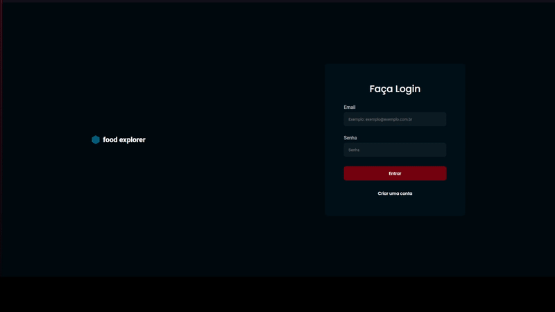
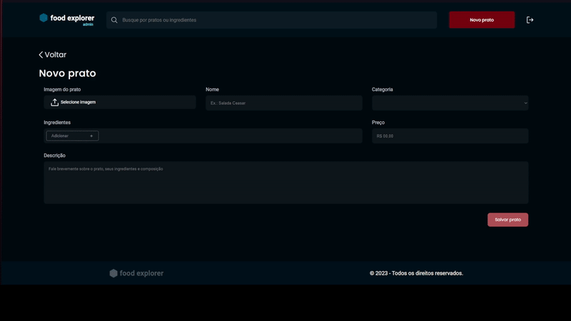
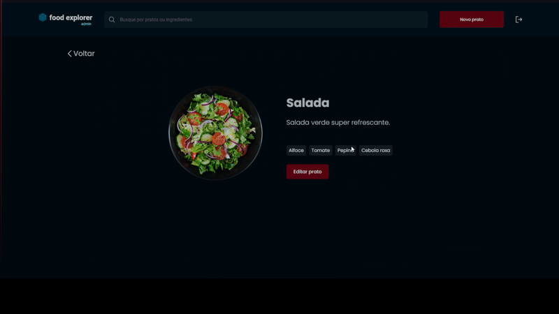
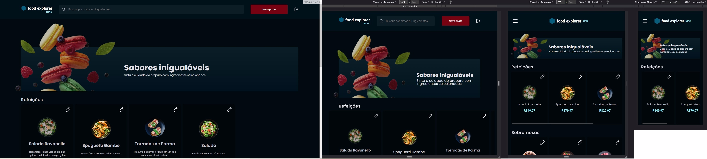

  
    

    Front-end do desafio final do curso Explorer da Rocketseat, sendo criado com ReactJS e estilizado com Styled-components e conexão com o banco
    de dados feito com Axios.

  

### Funcionalidades
As funcionalidades de: criar, excluir e editar pratos estão disponíveis para o admin. Busca por ingredientes e pratos disponível para ambos usuário e admin.

  

  

### Layout e Componentes Responsivos

    

O back-end também está 100% funcional e está em: https://github.com/kdimsan/back-end-FoodExplorer

Sinta-se à vontade para realizar qualquer teste com a funcionalidade de usuário: email: admin@email.com senha: 123

Caso deseja fazer um pull do projeto, basta rodar npm install tanto no front-end quanto no back-end e alterar a rota da api para onde está localizado o servidor do 
back-end.
Também está disponível em: https://ricardoadamefoodexplorer.netlify.app
